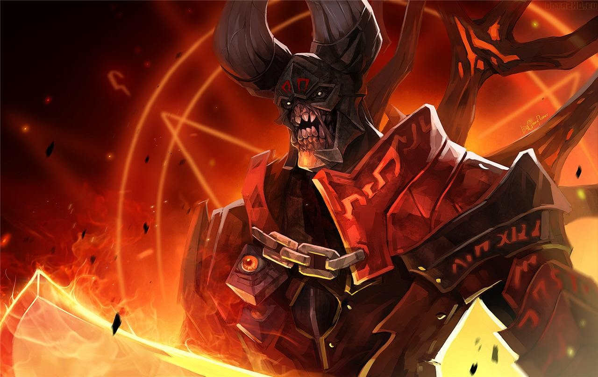

# Dota自走棋：从游戏到源代码
>这是一个很有趣的故事，讲述了我在自走棋这款游戏的奇妙经历，从最初玩游戏通宵上分，到最后与开发者接触并交换意见，从一名玩家成为了（自认为）一名社区成员。

Dota自走棋这款游戏是基于目前世界上具有想到高知名度的老牌MOBA游戏Dota2的一款新兴游戏，由国人巨鸟多多工作室开发，在2018-2019年再一次掀起了新的世界级游戏热潮。

## 最初接触
我最初接触这款游戏是19年年初，大学四年级寒假，在家乡被几个发小们带动入坑，成为了一名“棋手”。

Dota自走棋集成于Dota2游戏，两者有一个典型的共同点：上手难度极高，对新手不友好。因为这个原因，若要想真正成为一名棋手，需要数十数百的对局经验，才可以说是稍稍入门。这也是后期自走棋与腾讯效仿作品《云顶之奕》的市场争夺战中失败的其中一个巨大原因，另一个原因便是承载云顶的游戏英雄联盟有着比Dota2更庞大的用户群。

##### 自走棋基本玩法
>自走棋每局游戏共有八名玩家参与，分别占据九宫格的外层八个格子，每回合系统会随机提供五张英雄棋子供玩家购买，玩家可以消耗金钱主动刷新所提供的棋子或进行升级。玩家可以将拥有的英雄棋子排列上场，每回合随机与另外一名玩家上场的英雄组合进行对决，对决输者根据场上剩余敌方棋子数量被扣血，直到一百点血上限消耗殆尽，则该玩家出局，场上存活的最后一名玩家则为本场游戏的胜者。

>游戏中不同的棋子拥有不同的种族与职业，场上相同种族与职业的棋子在一定条件下将获得羁绊buff，提升棋子的战斗能力。刚刚购买得到的棋子为一星，三枚相同的棋子将合成并升星，英雄能力将获得大幅度提升，最高为三星。

>游戏存在段位排名机制，借鉴国际象棋棋子，以士兵、骑士、主教、堡垒、国王、皇后为段位，获得对局的前四名将获得加分，后四名则减分。上分之路十分艰难，绝大多数的玩家都停留在士兵骑士等级，主教堡垒都难以触及，更何况最上层的国王皇后，也别谈希望自己拥有全球前几的排名了。

以上就是自走棋的基本玩法，看似简单，若要上手却十分困难。只有对所有的棋子能力与羁绊buff了如指掌，对局势与不同组合之间的相互克制的有效洞察，对游戏拥有极强的理解，并且拥有极佳的运气，才能求得一胜，成为一名棋手。

## 真正的棋手
毫无疑问，自走棋拥有着让人难以摆脱的魔力，一旦上手成为一名棋手，就会发现其中的乐趣，在最初接触的那段时间，我也与朋友们常常通宵开黑，一起下棋上分。在第零赛季的三个月内，我也始终拜托不了士兵骑士的魔咒，突破不到更高段位。

经历了三个月的摸爬滚打，第零赛季结束，游戏新版本不断的迭代，新的英雄棋子、新的装备与新的羁绊buff不断更新。在骑士段位被暴捶了三个月之后，在第一赛季的“六地精”时代，我对版本和游戏的理解似乎突然进化了，凭借强势而熟练的上分英雄组合，连续取胜连续上分，终于突破了主教，直指堡垒。

这个时候我才认识到，或许突破主教的障壁，才能真正说对这个游戏上手了。而主教和堡垒才是刚刚开始，与你共同对局的其他玩家都是主教堡垒的高手，在这一阶段考研的是对游戏真正深入的理解，甚至考验一个玩家的智力水平与心态。这个时段，我可以将自己视作一名合格的普通棋手了，这真的很难。

这是春天的事情了，即将进入本科毕业设计收尾阶段的我，也暂且放下了游戏，努力位毕业论文做准备。但是不管版本怎么更新，当我偶尔登陆游戏放松一下的时候，我总能获得胜利，或许是因为我对游戏的理解真的变深了。

到了这个段位，只是单纯的玩游戏已经远远不够了，若想进一步提升段位与棋技，就必须要从更多地方获得经验与想法，与朋友兄弟间的开黑小打小闹就是纯粹娱乐了，大多数朋友的棋技也逐渐被我拉开，因为不同段位的对局会使得上分与掉分失衡拉大，所以我多数时间在主教堡垒局自行钻研，从哪进一步获得新的理解与想法呢。

## 小黑盒自走棋社区
Steam，由美国传来的世界最大的游戏平台，世界上绝大多数游戏，包括Dota2，都在Steam平台上发布，玩家们在平台上消费购买正版游戏，无论是PC端还是主机端，各类游戏应有尽有。

小黑盒，由国内企业出品，专为Steam游戏玩家定制，集新闻资讯、游戏资料库、玩家社区、战绩查询为一体的手机APP，小黑盒与Steam联通，用户可以在APP上获取大量游戏相关的资讯、攻略，也可以在玩家社区内与不同玩家进行互动分享。那如何获得新的想法，没有错，便是小黑盒自走棋社区。

自走棋风靡之后，全球数十万的玩家沸腾了，国内玩家自然也在小黑盒上聚集起来，自走棋社区也成为首页即可看到的榜上有名的社区。每天都有数以百计千计的玩家在社区内发布各类自走棋相关文章，包括版本更新内容、游戏攻略、阵容搭配、新颖思路、上分指南、同人故事、新版本猜想、对开发者的建议等等。即便是游戏的开发者也常常混迹与自走棋社区，毕竟这是开发者了解玩家想法的一大重要途径。

包括我在内的众多的玩家在自走棋社区内不断的分享交流游戏的见解，并为开发者提供新的版本思路，我相信虽然没有很多公开信息能证明，但开发者在自走棋社区内必然了解到了非常多有用的信息与玩家意见，以及创新性的思路。

其中不乏有许多IT背景的游戏玩家在社区内分享着对游戏源代码的理解，那时的我多数只是娱乐，或忙于自己的工作，游戏源码引起了我的兴趣，但我并没有分神去真正解读。

## 谢谢老板的飞机
作为一名游戏玩家，并不是时时刻刻都在打游戏，工作繁忙也没有大片时间真正享受游戏，所以很多游戏玩家都有一个同样重要的日常消遣，那就是看直播，我也不例外。作为一名自走棋玩家，我也有喜欢看的自走棋主播：棋待诏。

棋待诏是第一届Dota自走棋大赛的冠军，对游戏有极深的理解，多次问鼎皇后榜一，每一个新版本都有他开创的强势阵容，直播质量高也很有意思。除了自己游玩、在小黑盒社区讨论以外，看棋待诏的直播也帮助我不断理解游戏，我成为一名合格的棋手与他的经验密不可分。

从年初开始我就关注棋待诏的直播，偶尔发发弹幕，与他的互动不算很多。直到今年8月，在我遗憾失恋的一天，与棋待诏在弹幕里进行了大量的互动，并且为他刷了一架飞机。“谢谢XXX的一架大飞机，非常非常的感谢”棋待诏这么在直播间感谢着，想不到有一天我也成了刷飞机的老板。

从此以后我在直播间与主播和其他水友越来越熟，当自己粉丝等级达到一定等级之后，加入了主播所在的高级粉丝群，群里有一百多个水友，大家都是喜欢主播、喜欢自走棋的水友玩家。

由于当初是因为失恋的话题与棋待诏进行互动的，所以我一直被直播间的水友称为“本直播间唯一指定情感嘉宾”，那段时间跟群里的朋友互动很好，每天都在聊天水群，交流新的版本新的阵容。我的棋技在群里属于中游，群内的国王皇后段位的水友很多，包括主播在，与他们的互动好比在某IT开源社区与高级布道师的交流，对游戏的收益颇多。

**这个群，是我们直播间专属的一个小型社区吧。**

## 技术部门向源代码发起进攻
又过了两个月的时间，棋待诏的直播间不断壮大，水友越来越多，水友群的人数已经突破了两百，而我，绝不可能是群内唯一的程序员。事实上，群里常常一起聊天的水友中，就有4名程序员，而我们就是棋待诏直播间的技术部门。

**没有错，为了上分，我们开始分析游戏源码。**

Dota自走棋的游戏源码是公开的，随意都可以访问。自走棋由lua语言开发，是一个小巧的轻量级游戏脚本语言，虽然我的技术栈中不包含lua，但看懂代码逻辑对我们程序员来说不是问题。

最初我们并没有直接去观测游戏内部机制，而是为了更好的帮助棋待诏再次攀登榜一，从代码中分离出了游戏当前排位名次所在的文件，并简单开发了一个接口搭载在其中一个程序员水友的服务器上，这样我们就可以随时随地查看当前游戏的皇后前五十名排名情况，以及大家的隐藏分差。

若想要进一步上分，除了游戏经验交流以外，我们还可以选择分析源代码，分析游戏本质，棋子的移动，技能的释放等等，摸清楚这些就掌握了别人所没有掌握到的知识。所以我们程序员便开始分析源码中比较关键的点，并且真的有许多重大发现。

##### Doom的重大发现
>自走棋的英雄池中有一个价格为4金币的棋子：Doom，他在自走棋中拥有的技能叫“末日”，能够沉默敌方等级最高的棋子，也就是使得该棋子无法释放技能，所以这个技能是法师类棋子的天敌。试想一下，如果你的阵容的主要伤害要依靠一个高级棋子的强力技能进行大范围攻击，在即将施放技能的时候被Doom的技能封印，那你的阵容必输无疑，所以玩家们都在研究如何让自己最强的棋子被“末日”这个技能击中。

>如果场上只有一个最高等级的棋子，那么这个棋子肯定无法避免被“末日”击中，但如果场上最高等级的棋子不止一个，而是两个，那“末日”这个技能又会如何选定目标呢，如果你拥有两个高等级棋子，一个法师，一个战士，那自然更希望被“末日”击中的是战士，那样你的法师就仍然能够施放技能，造成大量伤害扭转战局。

>经过我们的分析发现，“末日”这个技能确实是选择最高等级的棋子，具体机制是，施放技能时，算法会遍历敌对阵容的棋子列表，当新遍历的棋子等级大于等于之前的最高等级时，技能选择的目标则发生变化，也就是说，技能选定的目标是这个列表中的最后一个最高等级的棋子，只要我们让战士在列表中的位置在法师之后，我们就能避免法师被“末日”锁定。

>那这个棋子列表的顺序是如何确定的呢，经过阅读代码，我们发现这个顺序并非随机产生的，而是根据用户对棋子的上阵下阵即时改变的，先上阵的棋子将排列在列表的前方，后上阵的则在后方，所以只要在每次进行阵容调配时，先上阵法师，再上阵战士，那么列表中战士就一定会在法师后方，也就是说，一定会将“末日”技能引导到战士身上。

这一个机制看似简单，却是自走棋游戏社区的首次发现，“末日”这个技能可以说是游戏中最为头疼的几个技能之一，为玩家们游戏对局具有很大的意义。

## 开发者居然听我们的改游戏了
这个时候已经是秋天了，我的研究生学业开始了，事情很多，没有什么时间玩游戏了，但是还是会跟群里的水友们一起聊天，说游戏，看直播，几个程序员一起研究游戏的源代码，给棋待诏不断的提新点子，他重回榜一的路也是曲曲折折。

>有一次在分析棋子技能时，关于棋子“神谕者”的技能“命运敕令”。自走棋是由国人开发，代码中的变量名，尤其是技能的变量名通常以拼音命名，“命运敕令”的技能变量名命名为mingyun**she**ling，技能中“敕”字的拼音为chi，但很明显，变量名中的she为开发人员因拼写错误而诞生。

>这个有很有意思了，我们把这个位置记下来，并且在github上给开发者提了一个issue。过了几天，这个issue有了回应，原来拼错的变量名依然是错的，但是在那行代码的上方多了一行注释：“这个地方当时开发的时候拼错了，应该是chi，但是后面牵扯太多代码了不好弄就懒得改了【捂脸】”

这样的问题并不多见，但是别忘了，棋待诏是Dota自走棋元老，甚至可以说玩家第一人，他是与开发者巨鸟多多工作室有来往的，凭借他对游戏深入的理解和我们几个程序员水友，我们与开发者有了直接的接触，并且多次提出一些问题的改进，特别是在一次大的版本更新后的抽棋机制变得并不合理，开发者为了加快对局节奏，缩小了棋子池。针对这一点棋待诏与我们几个程序员，给开发者直接做了建议，也就有了现在合理而受欢迎的“**D++**”抽棋机制。

## 再见，棋手

现在是2019年12月，我已经两个多月没有玩自走棋了，之前的水友群也因为一些原因而退出了，自走棋仿佛成为了我的历史，留下的只有过去的战绩和群里认识的几个加了微信的好友。

这是我本来生活中突然冒出来的支线剧情，当学校的课程要我们写下参与社区经历的文章，我才意识到，原来我早已是一名社区成员，一名Dota自走棋社区成员。这个游戏我从陌生到熟悉，从一名棋手到一个社区成员，从分析代码发现重大突破到直接给开发者做出建议，起源于游戏，终结于源代码。

再见，自走棋。

再见，棋手。

